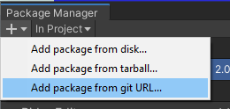
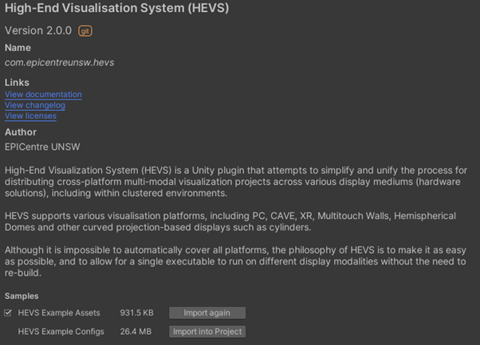
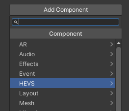
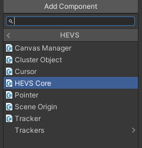
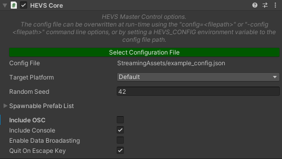
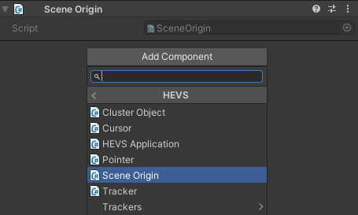
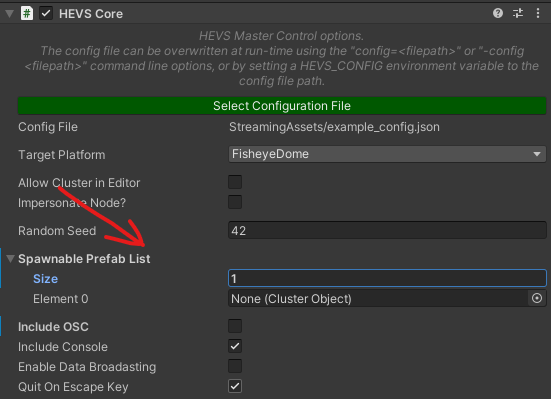

| [Home](https://github.com/EPICentreUNSW/hevs/) | [User Guide](UserGuide.md) | [Configuration Guide](ConfigGuide.md) | [Porting Guide](PortingGuide.md) | [API](API.md) |
|-|-|-|-|-|
# Porting Guide
This guide outlines the process for converting an existing Unity project to work with HEVS, so that a single build may be used across multiple platforms. The complexity of this process will depend on the project.

It is recommended that you first setup a new Unity project following the steps outlined in the *User Guide* so that you are familiar with how HEVS works, before attempting to port an existing project to use HEVS.

## Add HEVS to the Project

Open the Package Manager (Window -> Package Manager) to add the package via git:



Use the following URL to import the package:

https://github.com/EPICentreUNSW/hevs/.git

The package includes samples that demonstrate certain HEVS features, as well as an example JSON configuration and an example display warp image. When importing the configuration and warp samples, be sure to move the imported files into the StreamingAssets folder so that they can be accessed at run-time.



## Add a HEVS Core Component
The minimum required scene addition needed for HEVS to run is to include a HEVS Core component on a single GameObject within the scene:






The CORe component can be added to a new GameObject or an existing one.

## Setup Main Camera
At runtime, the HEVS Application component will search for a camera tagged with Main Camera. This camera will be used to generate the camera rig specified in the configuration file. Ensure that the camera you wish HEVS to use is present in the scene and tagged Main Camera. 

There should only be one main camera in the scene, other cameras will be ignored. Furthermore, HEVS assumes that only one camera is being used the whole time. If your project cycles between active cameras – such as destroying and instantiating them - then you will need to change this behaviour.

## Setup Scene Origin
Much like a traditional VR environment, HEVS displays are all created relative to a “Scene Origin”. If the scene origin moves then the displays move with it. It is advised to you attach a HEVS Scene Origin component to the GameObject that is used to represent your “user”:



## Scripting Requirements and Considerations
Your project’s scripts will need to be modified to work with HEVS, in particular when dealing with Time and Input. In these cases, Unity’s functions have been recreated in the HEVS namespace, so you can simply change your scripts to reference HEVS rather than the Unity function, as explained below.

HEVS can be used in a deterministic way, or non-deterministic. What this means is that you can either rely on the fact that every node within a clustered platform will do the exact same things at the exact same times, predictably, or that you instead adopt a master-authority architecture where the master node controls all logic, and the client nodes just respond to commands from the master.

Depending on your architecture, custom scripts may require some changes to function correctly on various platforms. Specific issues may include Time and Input, as within a cluster these aspects must be synchronised from a master node.

You may also need to setup Remote Procedure Calls (RPC) if adopting a non-deterministic approach.

Below are notes on HEVS components and code that you may make use of.

For further details check the HEVS API documentation.

### Time
HEVS.Time needs to replace all calls to UnityEngine.Time. It syncs the current time and delta time from the master for all client nodes to use:
```csharp
// UnityEngine - don't use!
float wrong_dt = Time.deltaTime;

// HEVS - use this instead!
float correct_dt = HEVS.Time.deltaTime;
```
### Input
HEV.Input needs to replace all calls to UnityEngine.Input. It implements the same methods (i.e. GetKey/GetButtonDown) but syncs the data from the master node to all client nodes, and can include input from alternative sources, such as VRPN devices:
```csharp
// UnityEngine - don't use!
if (Input.GetButtonDown("Fire1"))
{ }

// HEVS - use this instead!
if (HEVS.Input.GetButtonDown("Fire1"))
{ }
```
### Camera Main
In some cases the UnityEngine.Camera.main will be disabled depending on a node’s display configuration. In this case UnityEngine.Camera.main will return null.

At run-time HEVS reconfigures the camera hierarchy to setup any required capture and output cameras for the specified displays within the configuration file. All new cameras and GameObjects will be parented to the original UnityEngine.Camera.main regardless of if it is enabled or not.

HEVS provides access to the main camera via the HEVS.Camera.main static variable, so it is recommended that all calls to Camera.main go through HEVS:
```csharp
// UnityEngine - don't use!
Camera.main;

// HEVS - use this instead!
HEVS.Camera.main;
```
### Random
You may still use Random within your application as calls to Random are deterministic based on the random seed value. However, within a cluster random can get out of sync if the calls aren’t all synchronised between all nodes. For example, if node A calls Random.value and node B calls Random.value twice, then the random sequence will no longer be synced between the two nodes.

Try to ensure that all calls to Random are made at the same time on all nodes.

When the application starts up the HEVS Core component will set the random seed on all nodes, based on the component’s value:


## Cluster Synchronisation
While HEVS handles most of the tasks needed to synchronise a Unity program running in a cluster, additional work will need to be done for some projects to ensure they run properly.

### Cluster Objects
The ClusterObject component is used to make an object synchronise its position, rotation and scale across a cluster. The behaviour of the object on the master node will be mirrored on each client. Synchronisation occurs in LateUpdate, and so changes made to the object on the clients will not take effect. 

### Remote Procedure Calls
The RPC class is used to trigger RPC calls from the master to clients, and/or from a client back to the master. All calls execute at the end of the frame on all nodes, at the start of LateUpdate().
RPC can work in two ways, either by calling a method on a MonoBehaviour attached to a GameObject that contains a ClusterObject component, or by calling a static method. 
* A HEVS.RPC attribute must be added to methods for calling MonoBehaviour methods on GameObjects with ClusterObject components.
* Static methods must also have the HEVS.RPC attribute, however the owning class must also derive from the HEVS.IRPCInterface interface.

#### Non-static RPC Example:
```csharp
public class RPCExample : MonoBehaviour
{
    [HEVS.RPC] // RPCAttribute
    void MyRPCCall(string msg)
    {
        Debug.Log(msg);
    }

    void Update()
    {
        if (HEVS.Cluster.isMaster &&
            HEVS.Input.GetButtonDown("Fire2"))
            HEVS.RPC.Call(MyRPCCall, "Hello World!");
    }
}
```
#### Static RPC Example:
```csharp
public class StaticRPCExample : MonoBehaviour, HEVS.IRPCInterface
{
    [HEVS.RPC] // RPCAttribute
    static void StaticCall(string msg, int number)
    {
        Debug.Log(msg + " " + number);
    }

    void Update()
    {
        if (HEVS.Cluster.isMaster &&
            HEVS.Input.GetButtonDown("Fire2"))
            HEVS.RPC.Call(StaticCall, "Hello!", 1);
    }
}
```
### Named Cluster Variables
HEVS contains a template class ClusterVar<T> to allow synchronising variables based on a name. Variables are synced from a master node to client nodes at the start of LateUpdate(), overriding any local changes on the client. All ClusterVar use a name to uniquely identify themselves.
```csharp
HEVS.ClusterVar<bool> triggered = new HEVS.ClusterVar<bool>("Triggered");
HEVS.ClusterVar<Vector3> home = new HEVS.ClusterVar<Vector3>("Home");
```
### Instantiating and Spawning
If a Cluster Object is created using a traditional Unity Instantiate call, then its instances will not synchronise over the cluster; each node that called Instantiate will instead have its own unique local instance of the object that behaves independently from all other nodes.

There are two ways in which an object can be created and synced with HEVS; pre-registered prefabs, or via a factory method, both called from the Master node only.

In both cases the object being spawned isn’t created straight away, but is instead created during LateUpdate(). The methods return the Cluster ID of the object being spawned, which can be used to find the object once it has actually been instantiated.

To create a Cluster Object at runtime using a Prefab, the object first needs to be saved as a Unity prefab and added to the spawnable prefab list variable on the HEVS Core component:



Instances of prefabs on this list can then be spawned at runtime using the Cluster spawn method: 
```csharp
public class SpawnPrefabExample : MonoBehaviour
{
    // the prefabObject must be added to the Spawnable Prefab List first
    GameObject prefabObject;

    void Update()
    {
        if (HEVS.Cluster.isMaster &&
            HEVS.Input.GetButtonDown("Fire2"))
            HEVS.Cluster.Spawn( prefabObject, Vector3.zero, Quaternion.identity);
    }
}
```
Alternatively, Cluster Objects can be spawned and dynamically created at run-time using scripts via a Factory pattern. 

A spawn method which has a GameObject and params object[] as arguments is first registered using an integer identifier for the method (it is recommended to register this method within a static initialiser method):
```csharp
HEVS.Cluster.RegisterSpawnHandler(MY_FUNC_ID, MySpawnFunc);
```
A GameObject can then be spawned using the HEVS.Cluster.Spawn() method which takes in the integer method identifier, rather than a GameObject prefab, a name for the new GameObject, along with any arguments you need for your spawn method:
```csharp
HEVS.Cluster.Spawn(MY_FUNC_ID, "New Name", Vector3.zero, Vector3.forward);
```
The Spawn() call will create a GameObject on all nodes within a cluster, assign it a ClusterObject with a cluster ID, then pass the object into your spawn method on all nodes along with any arguments you provided. Your method’s job is then to attach any additional components or set any required variables for your custom object:
```csharp
public static void MySpawnFunc(GameObject go, params object[] args)
    {
        Vector3 position = (Vector3)args[0];
        Vector3 facing = (Vector3)args[1];

        // position the object based on arguments
        go.transform.position = position + facing;

        // add a mesh to the object
        go.AddComponent<MeshFilter>().mesh = PrimitiveHelper.GetPrimitiveMesh(PrimitiveType.Cube);
        go.AddComponent<MeshRenderer>().material.color = Color.white;

        // add some physics to the box on the master only
        if (HEVS.Cluster.isMaster)
        {
            go.AddComponent<BoxCollider>();
            go.AddComponent<Rigidbody>().AddForce(facing * 30, ForceMode.Impulse);
        }
    }

```