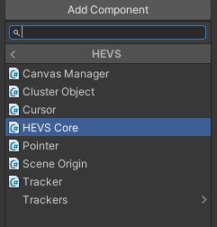
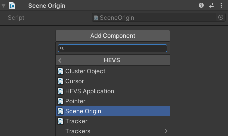
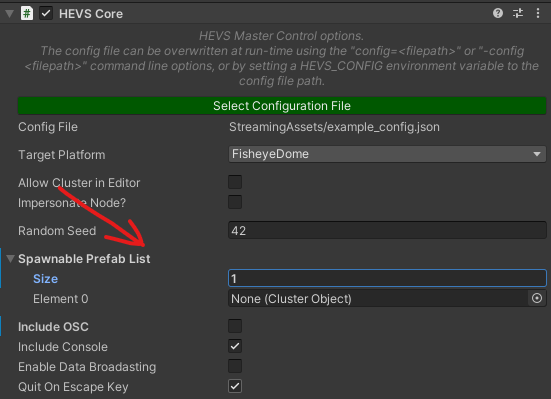

| [Home](https://github.com/EPICentreUNSW/hevs/) | [User Guide](UserGuide.md) | [Configuration Guide](ConfigGuide.md) | [Porting Guide](PortingGuide.md) | [API](API.md) |
|-|-|-|-|-|
# User Guide
## What is HEVS?
The Collaborative High-End Visualisation System (HEVS) is a Unity3D plugin that attempts to simplify and unify the process for redistributing cross-platform visualisation projects across various display mediums, including within clustered environments.

HEVS supports various visualisation platforms, including CAVE, domes and curved projection-based displays, as well as standard Unity platforms such as Virtual Reality / Augmented Reality (AR/VR).

HEVS is distributed as multiple Unity Package Manager packages available via git.

The HEVS architecture implements various concepts:
* **Visualisation Platforms:**
  * A Platform represents the entirety of a visualisation installation that will be running the application instance. This might be a single-node standalone PC instance, VR system, handheld device, or a clustered installation utilising multiple hardware devices running synchronised application instances such as a CAVE or multi-projector display wall. A Platform encapsulates all hardware devices and their settings.
* **Nodes:**
  * A Node represents a running instance of a HEVS application. A host device, such as a desktop PC, typically runs a single instance and represents the Node, however it is possible to run multiple nodes from a single hardware device. A clustered Platform contains multiple nodes.
* **Displays:**
  * A Display represents a potential output image from a Node. This output image may be output onto a connected display device, such as a monitor or projector, and can represent the entirety of the display or a simply a viewport region of the connected device. A Node can contain multiple displays. Displays can be configured to represent standard pin-hole perspective display, off-axis perspective display, wide field-of-view (FOV) curved displays, or fisheye dome displays. It is also possible to configure custom display types.
* **Clusters:**
  * A cluster is a Platform represented by multiple nodes, where one node acts as the Master and the remaining node act as Clients. The Master synchronises its time and input with the clients and keeps all nodes in lockstep. 
* **Trackers:**
  * HEVS can keep application object transforms in sync with real-world tracked rigid bodies from various tracking systems, including motion capture (mocap) systems and VR tracked devices, such as controllers. Transforms are typically sync on the Master within a cluster, then synchronised from the Master to all Client nodes.

### License
Copyright 2021 EPICentre UNSW

Permission is hereby granted, free of charge, to any person obtaining a copy of this software and associated documentation files (the "Software"), to deal in the Software without restriction, including without limitation the rights to use, copy, modify, merge, publish, distribute, sublicense, and/or sell copies of the Software, and to permit persons to whom the Software is furnished to do so, subject to the following conditions:

The above copyright notice and this permission notice shall be included in all copies or substantial portions of the Software.

THE SOFTWARE IS PROVIDED "AS IS", WITHOUT WARRANTY OF ANY KIND, EXPRESS OR IMPLIED, INCLUDING BUT NOT LIMITED TO THE WARRANTIES OF MERCHANTABILITY, FITNESS FOR A PARTICULAR PURPOSE AND NONINFRINGEMENT. IN NO EVENT SHALL THE AUTHORS OR COPYRIGHT HOLDERS BE LIABLE FOR ANY CLAIM, DAMAGES OR OTHER LIABILITY, WHETHER IN AN ACTION OF CONTRACT, TORT OR OTHERWISE, ARISING FROM, OUT OF OR IN CONNECTION WITH THE SOFTWARE OR THE USE OR OTHER DEALINGS IN THE SOFTWARE.

### Third-Party Dependencies and Licenses

This package contains third-party software components governed by the license(s) indicated below:

#### LibTiff.NET
License Type: MIT

https://github.com/BitMiracle/libtiff.net/blob/master/license.txt 

#### VRPN
License Type: Boost Software License 1.0 (BSL1.0)

https://github.com/vrpn/vrpn/blob/master/README.Legal 

#### NetMQ
License Type: GNU LESSER GENERAL PUBLIC LICENSE v3

https://github.com/zeromq/netmq/blob/master/COPYING.LESSER 

#### OSCSharp
License Type: MIT

https://github.com/valyard/OSCsharp/blob/master/License.txt 

#### TUIOSharp
License Type: MIT
https://github.com/valyard/TUIOsharp/blob/master/license.txt

## HEVS Requirements
### Software Requirements
HEVS applications currently support the following operating systems:
* Microsoft Windows 7 & 10
* Apple Mac OSX
* Linux
* Android

Some platforms will function differently. Ensure you are running latest drivers.

HEVS can be run in conjunction with third-party display blending & warping software for curved surfaces.

#### Required Unity3D Version:
HEVS applications are developed using Unity3D.

The current officially supported versions of Unity are 2021.2+

HEVS supports the Standard Render Pipeline (SRP), Universal Render Pipeline (URP), and the High-Definition Render Pipeline (HDRP).

### Hardware Requirements
HEVS can support various platform configurations. Performance is dependent on your hardware and platform configuration, with some display types being more intensive than others. Clustered platforms should be set up with minimal latency between the nodes. HEVS uses very little bandwidth, but latency can cause performance slowdown for synchronisation.

Nvidia Quadro hardware is required for hardware frame-syncing. See the Nvidia website for further details and supported GPUs: https://www.nvidia.com/en-us/design-visualization/solutions/quadro-sync/ 

Nvidia Quadro hardware is also required if you wish to use Quad-Buffered stereoscopic (https://www.nvidia.com/object/quadro_stereo_technology_in.html).

## Clustering and Synchronisation in HEVS
HEVS can be used to implement clustered display platforms.

HEVS uses a master-client network topology using two socket ports with the following protocols:
* Master
  * Publisher – used for publishing cluster state data at two points in the update loop; pre-update the master broadcasts time state to the clients, post-update the master broadcasts cluster variables, transforms, spawn calls and Remote Procedure Calls (RPC)
  * Reply – used for controlling cluster synchronisation and barriers for frame-locking
* Clients
  * Subscriber – used for receiving state data at two points in the update loop; pre-update it receives time state from the master that the client can use for processing and determinism within its update, and post-update it receives cluster variables and transforms to keep objects and data in sync and receives spawn and RPC calls
  * Request – used for sending notifications to the master that the client is ready to proceed


All synced GameObjects within a running HEVS application are given a ClusterObject component. This component gives the object a unique identifier within HEVS’ clustering This identifier is used for synchronisation purposes.

HEVS synchronises:

* Time – the master sends its current time, its deltaTime, and its current frame to all clients
* Input – the master sends all currently pressed buttons, keys and axis. This data is then used to check if a button/key has changed its state to down or up.
* Cluster Transforms – a component that registers a GameObject’s transform to be synced across the cluster from the master every update.
* Cluster Variables – named variables stored within templated ClusterVar<T> objects.
* Spawn Calls – factory methods can be registered with a HEVS Cluster and then spawn calls can be made via the Cluster class. This triggers the creation of a GameObject on all nodes which receives a ClusterObject component and is then passed into the factory method to be setup further, as per your project’s specifications. The object is not spawned the moment the spawn call is made, but rather it is created at the end of the update when HEVS synchronises state data.
* Remote Procedure Calls (RPC) – the master can trigger RPC calls which get added to a queue rather than executed immediately. At the end of update the master broadcasts the RPC calls, along with arguments passed to the method, to all cluster nodes. All nodes, including the master, then execute the call simultaneously at the end of update. Client nodes can also trigger an RPC on the Master node.
* Application-specific Payloads – additional user defined data can be serialised/deserialised onto the data packet used for synchronisation.

HEVS synchronises at two points:
* Pre-Update – called before all other scripts trigger their Update() method
* Post-Update – called before all other scripts trigger their LateUpdate() method


The pre-update sync step broadcasts the Time and Input data, as well as any additional user data. This allows all nodes to update and use these values rather than their local data. Using this data you are able to implement completely deterministic projects that will remain in sync, provided you don’t use any local data or different calls to random number generators.

Post-update broadcasts named variables, transforms, spawn calls and RPC. This means that even if a client modifies a variable or transform, that it will be overridden by the master. Using this allows you to make a purely master-controlled application where the clients are merely renderers. This also ensures that spawn calls and RPC are triggered at the same time on all cluster nodes.

More information on using HEVS clustering components is available within the Creating a Project with HEVS section later in this document.

### Data Broadcasting
HEVS implements additional data broadcasting capabilities, which are useful for sending large packets of data, such as files and meshes, from the Master to all Clients nodes within a cluster. This makes use of an additional port and streams data in parallel, not blocking the update and rendering of the application instance. Once the data has been received by a client it triggers a callback where the application can respond to the data.

## Getting Started
HEVS aims to be simple to integrate within a Unity3D project and simple to run on multiple platforms without having to create separate builds.
To achieve this there is some initial setup that is needed; creating a configuration file that describes your target platform/s, adding 1 or more additional components to a Unity3D scene, building and deploying the Unity3D project, and then launching.

### Configuration Setup
HEVS uses a JSON (JavaScript Object Notation) format for defining platform configurations. One or more platforms can be defined within a single JSON file, which is explained further within the HEVS Configuration Guide document.

The JSON file needs to be in a path that is accessible from all running instances of your application. This may be on a shared network drive or duplicated locally on each node that will be running the application. The file path can be set inside of Unity within a HEVS Core component detailed later in this document; however it can also be defined as a command-line argument “-config configpath” when launching your application or can be defined within an environment variable on each target node called HEVS_CONFIG. The order of precedence for the config file path is: 

**Command-Line > Environment Variable > GameObject Component**

It is recommended that you use the environment variable option as this can be altered per-platform allowing you to use the same executable and launch without having to define additional command-line arguments for each platform.

### Importing HEVS
HEVS is distributed via git for use within Unity’s Package Manager. 

https://github.com/EPICentreUNSW/hevs.git

Open the Package Manager (Window -> Package Manager) to add your selected package via git:


The package includes samples that demonstrate certain HEVS features, as well as an example JSON configuration and an example display warp image. When importing the configuration and warp samples, be sure to move the imported files into the StreamingAssets folder so that they can be accessed at run-time.


### Scene Setup
The minimum required scene addition needed for HEVS to run is to include a HEVS Core component on a single GameObject within the scene, and a single Camera tagged as MainCamera:





The HEVS Core component is responsible for reading a JSON configuration file (see the HEVS Configuration Guide.doc) and modifying the scene at run-time based on a specified platform within that configuration file. Although the component has a Target Platform dropdown, this list is populated from a loaded config file, and is not a hard-set list of platforms. This means that if you select a target platform within the component, it can be changed at run-time as mentioned below, or may not be a valid platform if a different config file is chosen. The list is populated by platforms within the configuration file that was set within the editor.

At this point , with just the HEVS Core component and a single MainCamera, HEVS has been successfully installed and setup. When the application runs, based on the config file used and target platform, HEVS will reconfigure the MainCamera to correctly output to the desired display.

An example config file is provided with HEVS which you can load in-editor into your Core component, which will populate the platform dropdown with entries from the configuration file; you may also load your own configuration file, rather than the provided example. Using the Target Platform dropdown you can preview the platform within the editor, but also select a default platform to use when a build runs.
 


Config files and target platforms can be set on the HEVS Core component, or they can be assigned at runtime either via command-line arguments or system environment variables.

* Environment Variables:
  * HEVS_CONFIG: File path for the config json
  * HEVS_PLATFORM: Name of the platform within the config file to use as the running platform.
* Command-Line Arguments:
  * “-config *filepath*” replacing *filepath* with the config file’s path.
  * “-platform *platform*” replacing *platform* with the desired platform name.

The order of priority is:

**Command-Line Arguments > Environment Variables > Component Setting**

### Alternative Scene Setup – HEVS Prefabs
HEVS also includes pre-made helper prefabs that include a HEVS Core component along with additional HEVS components. They also contain a hierarchy for a Camera and tracked “hand” objects. **When using these prefabs you must also delete the existing MainCamera from your scene!**


The two prefabs are alike, except that the HEVSwCharacterController prefab includes a character controller on the HEVS GameObject that you can access via scripts to move the GameObject around.

Importantly the prefabs contain components for ClusterObject and SceneOrigin.

The HEVS ClusterObject component allows a GameObject to synchronise its transform within a cluster and contains a ClusterID used by HEVS for tracking the synced object. It also allows an object to sync when it is disabled, enabled or destroyed.

The HEVS SceneOrigin acts much like an XR tracker space origin; all displays and tracked objects are relative to this GameObject’s transform. There can be only one SceneOrigin component within a scene. 



Even if not using a clustered platform yourself, it is still good practice to ensure your application would still function adequately within a cluster so that you can distribute your application onto other platforms without needing to rebuild the project.

The Main Camera attached to the prefab’s root object is a standard Unity3D camera. 

The tracked hand objects contain three HEVS components; ClusterObject to ensure it is synced within a cluster, Tracker to enable tracking via a real-world device, and Pointer to allow the transform to interact with the HEVS platform by creating rays to pick the scene or platform’s displays.

Tracker adds tracking support to a GameObject. It uses the ID to check for its options within the platform’s config, but if no ID is found then it can fallback to use default options, such as UnityEngine.XR tracking system (such as VIve / Oculus) or fallback to track the mouse cursor as a pointer (which it can do by default within the editor).


 
## Scripting Requirements and Considerations
HEVS can be used in a deterministic way, or non-deterministic. What this means is that you can either rely on the fact that every node within a clustered platform will do the exact same things at the exact same times, predictably, or that you instead adopt a master-authority architecture where the master node controls all logic, and the client nodes just respond to commands from the master.

Depending on your architecture, custom scripts may require some changes to function correctly on various platforms. Specific issues may include Time and Input, as within a cluster these aspects must be synchronised from a master node.

You may also need to setup Remote Procedure Calls (RPC) if adopting a non-deterministic approach.

Below are notes on HEVS components and code that you may make use of.

The parts of HEVS exist within a HEVS namespace.

For further details check the HEVS API documentation.

### Time
HEVS.Time needs to replace all calls to UnityEngine.Time. It syncs the current time and delta time from the master for all client nodes to use:
```csharp
// UnityEngine - don't use!
float wrong_dt = Time.deltaTime;

// HEVS - use this instead!
float correct_dt = HEVS.Time.deltaTime;
```
### Input
HEV.Input needs to replace all calls to UnityEngine.Input. It implements the same methods (i.e. GetKey/GetButtonDown) but syncs the data from the master node to all client nodes, and can include input from alternative sources, such as VRPN devices:
```csharp
// UnityEngine - don't use!
if (Input.GetButtonDown("Fire1"))
{ }

// HEVS - use this instead!
if (HEVS.Input.GetButtonDown("Fire1"))
{ }
```
### Camera Main
In some cases the UnityEngine.Camera.main will be disabled depending on a node’s display configuration. In this case UnityEngine.Camera.main will return null.

At run-time HEVS reconfigures the camera hierarchy to setup any required capture and output cameras for the specified displays within the configuration file. All new cameras and GameObjects will be parented to the original UnityEngine.Camera.main regardless of if it is enabled or not.

HEVS provides access to the main camera via the HEVS.Camera.main static variable, so it is recommended that all calls to Camera.main go through HEVS:
```csharp
// UnityEngine - don't use!
Camera.main;

// HEVS - use this instead!
HEVS.Camera.main;
```
### Random
You may still use Random within your application as calls to Random are deterministic based on the random seed value. However, within a cluster random can get out of sync if the calls aren’t all synchronised between all nodes. For example, if node A calls Random.value and node B calls Random.value twice, then the random sequence will no longer be synced between the two nodes.

Try to ensure that all calls to Random are made at the same time on all nodes.

When the application starts up the HEVS Core component will set the random seed on all nodes, based on the component’s value:


### HEVS Core
The HEVS Core component is the brains of HEVS, it controls the initialisation of all HEVS systems, such as Cluster, Input, and RPC.

It contains many helper variables to access information such as the currently loaded configuration data, current platform, current node, current displays, and various other helper methods detailed in the HEVS API.

The Platform will contain all information about the current platform, including node lists, master nodes, cluster and stereo information, and all tracker information.

The Node will contain information about that node’s displays, id and other options.

Additionally, the Core component can generate a UnityEngine.Mesh from the current node’s display geometry, or from the geometry of all node displays within a platform:
```csharp
Mesh nodeMesh = HEVS.Core.GenerateMeshForActiveNode();
Mesh platformMesh = HEVS.Core.GenerateMeshForActivePlatform();
```
This can be useful when wanting to attach visuals to the displays, or to create collision geometry.

### Cluster
HEVS Cluster controls the synchronisation of data within clustered platforms. It can also be used to hook additional data to be broadcast, and to query if the current application instance is the master:
```csharp
// check if cluster is active
bool val = HEVS.Cluster.active;

val = HEVS.Cluster.isCluster;

// will also be true when not in a cluster
val = HEVS.Cluster.isMaster;

etc
```
Check the HEVS API documentation for more features.
### Remote Procedure Calls
The RPC class is used to trigger RPC calls from the master to clients, and/or from a client back to the master. All calls execute at the end of the frame on all nodes, at the start of LateUpdate().
RPC can work in two ways, either by calling a method on a MonoBehaviour attached to a GameObject that contains a ClusterObject component, or by calling a static method. 
* A HEVS.RPC attribute must be added to methods for calling MonoBehaviour methods on GameObjects with ClusterObject components.
* Static methods must also have the HEVS.RPC attribute, however the owning class must also derive from the HEVS.IRPCInterface interface.

#### Non-static RPC Example:
```csharp
public class RPCExample : MonoBehaviour
{
    [HEVS.RPC] // RPCAttribute
    void MyRPCCall(string msg)
    {
        Debug.Log(msg);
    }

    void Update()
    {
        if (HEVS.Cluster.isMaster &&
            HEVS.Input.GetButtonDown("Fire2"))
            HEVS.RPC.Call(MyRPCCall, "Hello World!");
    }
}
```
#### Static RPC Example:
```csharp
public class StaticRPCExample : MonoBehaviour, HEVS.IRPCInterface
{
    [HEVS.RPC] // RPCAttribute
    static void StaticCall(string msg, int number)
    {
        Debug.Log(msg + " " + number);
    }

    void Update()
    {
        if (HEVS.Cluster.isMaster &&
            HEVS.Input.GetButtonDown("Fire2"))
            HEVS.RPC.Call(StaticCall, "Hello!", 1);
    }
}
```
### Named Cluster Variables
HEVS contains a template class ClusterVar<T> to allow synchronising variables based on a name. Variables are synced from a master node to client nodes at the start of LateUpdate(), overriding any local changes on the client. All ClusterVar use a name to uniquely identify themselves.
```csharp
HEVS.ClusterVar<bool> triggered = new HEVS.ClusterVar<bool>("Triggered");
HEVS.ClusterVar<Vector3> home = new HEVS.ClusterVar<Vector3>("Home");
```
### Instantiating and Spawning
If a Cluster Object is created using a traditional Unity Instantiate call, then its instances will not synchronise over the cluster; each node that called Instantiate will instead have its own unique local instance of the object that behaves independently from all other nodes.

There are two ways in which an object can be created and synced with HEVS; pre-registered prefabs, or via a factory method, both called from the Master node only.

In both cases the object being spawned isn’t created straight away, but is instead created during LateUpdate(). The methods return the Cluster ID of the object being spawned, which can be used to find the object once it has actually been instantiated.

To create a Cluster Object at runtime using a Prefab, the object first needs to be saved as a Unity prefab and added to the spawnable prefab list variable on the HEVS Core component:



Instances of prefabs on this list can then be spawned at runtime using the Cluster spawn method: 
```csharp
public class SpawnPrefabExample : MonoBehaviour
{
    // the prefabObject must be added to the Spawnable Prefab List first
    GameObject prefabObject;

    void Update()
    {
        if (HEVS.Cluster.isMaster &&
            HEVS.Input.GetButtonDown("Fire2"))
            HEVS.Cluster.Spawn( prefabObject, Vector3.zero, Quaternion.identity);
    }
}
```
Alternatively, Cluster Objects can be spawned and dynamically created at run-time using scripts via a Factory pattern. 

A spawn method which has a GameObject and params object[] as arguments is first registered using an integer identifier for the method (it is recommended to register this method within a static initialiser method):
```csharp
HEVS.Cluster.RegisterSpawnHandler(MY_FUNC_ID, MySpawnFunc);
```
A GameObject can then be spawned using the HEVS.Cluster.Spawn() method which takes in the integer method identifier, rather than a GameObject prefab, a name for the new GameObject, along with any arguments you need for your spawn method:
```csharp
HEVS.Cluster.Spawn(MY_FUNC_ID, "New Name", Vector3.zero, Vector3.forward);
```
The Spawn() call will create a GameObject on all nodes within a cluster, assign it a ClusterObject with a cluster ID, then pass the object into your spawn method on all nodes along with any arguments you provided. Your method’s job is then to attach any additional components or set any required variables for your custom object:
```csharp
public static void MySpawnFunc(GameObject go, params object[] args)
    {
        Vector3 position = (Vector3)args[0];
        Vector3 facing = (Vector3)args[1];

        // position the object based on arguments
        go.transform.position = position + facing;

        // add a mesh to the object
        go.AddComponent<MeshFilter>().mesh = PrimitiveHelper.GetPrimitiveMesh(PrimitiveType.Cube);
        go.AddComponent<MeshRenderer>().material.color = Color.white;

        // add some physics to the box on the master only
        if (HEVS.Cluster.isMaster)
        {
            go.AddComponent<BoxCollider>();
            go.AddComponent<Rigidbody>().AddForce(facing * 30, ForceMode.Impulse);
        }
    }

```

## Project Deployment
The application should be deployed to the target systems. It is highly recommended to deploy to the same path on each local host, but this is not required for successfully using HEVS applications.

HEVS provides utility scripts for synchronising the project across all nodes within a cluster.

### Launching HEVS Instances
The deployed applications should be executed simultaneously. In some cluster configurations it is useful to launch the master instance first (it will wait for the clients to connect before proceeding). HEVS includes utility scripts for launching the application, but you may also use your own tools and scripts.

When the application launches it needs to know which platform it is operating within in addition to the path to the config file that it should use. The platform can be set via a command-line argument, or via an environment variable, or set within the HEVS Core component.

The environment variable HEVS_PLATFORM can be set to the name of the platform that you wish to use from the config file, or the command-line argument **-platform *platformname*** can be set. The order of precedence is the same as earlier mentioned for the config file.

The following is an example of a command-line launch for a HEVS application:

*MyDemo.exe -platform CAVE -config D:/hevsconfig.json*

All other Unity3D command-line arguments still apply. For example, to force an application to write out a log file you could use:

*MyDemo.exe -logfile log.txt  -platform Dome -config D:/config.json*

#### Additional Command-Line Arguments
In addition to the above-mentioned command-line arguments you may use the following:

* -node *nodename*
  * By default, a node will use its host device’s hostname to identify itself within the cluster. You can override the hostname by specifying an alternative name via the command-line. This is useful for making one node impersonate another at run-time, or to run multiple nodes on a single hardware device for a local cluster, each using a separate hostname to identify themselves within the config file.
* -nocluster
  * The application will read the platform information from the configuration file, however it will assume there was no cluster options specified and each node will run as if it was the only node specified within the platform.
* -nocursor
  * The cursor will automatically be disabled on client instances when within a cluster, however certain platforms can benefit with having the cursor disabled, such as a single-node non-clustered dome display where a desktop cursor would not make sense.
* -master-vsync
  * When operating within a cluster the master instance will have vsync automatically disabled to aid with network performance. You may want to enable it, which you can with this flag.
* -client-novsync
  * When operating within a cluster the client instances will have their vsync enabled automatically. If for some reason you want this disabled to you use this flag.
