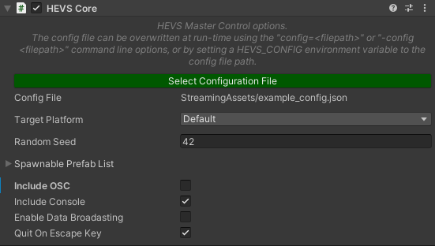

| [Home](https://github.com/EPICentreUNSW/hevs/) | [User Guide](Documentation~/UserGuide.md) | [Configuration Guide](Documentation~/ConfigGuide.md) | [Porting Guide](Documentation~/PortingGuide.md) | [API](Documentation~/API.md) |
|-|-|-|-|-|
# Multi-Modal High-End Visualisation System (HEVS)
## Project Page: [http://epicentre.matters.today/hevs/](http://epicentre.matters.today/hevs/)

Current Version: 2.0.0  
HEVS is an ongoing project which has been successfully used by:

* EPICentre, UNSW Art & Design
* iCinema, UNSW
* University of South Australia
* École polytechnique fédérale de Lausanne (EPFL), Switzerland

## What is HEVS?

Collaborative High-End Visualization System (HEVS) is a Unity3D plugin that attempts to simplify and unify the process for distributing cross-platform multi-modal visualization projects across various display mediums (hardware solutions), including within clustered environments.
HEVS supports various visualisation platforms, including PC, CAVE, XR, Multitouch Walls, Hemispherical Domes and other curved projection-based displays such as cylinders.

Although it is impossible to automatically cover all platforms, the philosophy of HEVS is to make it as easy as possible and to ideally allow for a single executable to run on multiple platforms. Afterall, if the backbone of the platform is a PC then why would we need seperate builds just because they output onto a different type of display?

HEVS supports:

* Windows 7 & 10 / OSX / Linux / Android (including Oculus Quest)
* Desktop, CAVE, XR, Dome and Curved projector-based displays
* Clustered and Non-Clustered platforms
	* Time and Input synced
	* Transform synchronisation
	* Named shared variables
	* Remote Procedure Calls (RPC) on Clustered GameObjects or on static methods
    * Data broadcasting
* Tracking systems over Virtual Reality Peripheral Network (VRPN), Open Sound Control (OSC) and XR
* Touch support via TUIO
* Hardware (gen-lock) or software frame syncing
* Stereoscopic displays
  * Mono, Side-by-Side, Top-Bottom, Red-Cyan/Red-Green/Red-Blue Anaglyph, 
	* Hardware QuadBuffering supported

## Supported Unity Versions

HEVS targets the following versions of Unity3D:

* 2021.2+

Standalone builds **only support x86_64** builds. x86 is not supported by HEVS:


**WARNING: Sometimes when you change the x86_64/x86 setting within Unity, Unity does not properly adjust native libraries. In these instances it is recommended you restart Unity which will resolve this problem.**

Follow the *User Guide* or the *Porting Guide* for how to add HEVS to a new or existing Unity project.

## Configuring HEVS

HEVS primarily works by reading a JSON configuration file that describes one or more installations (platforms) at run-time. Using the running hardware's hostname, and a specified platform, HEVS reconfigures the Unity scene to output correctly and joins any specified network cluster.
In this way a single executable can reconfigure itself in many different ways using different platform definitions.

HEVS uses the following basic JSON structure:

```javascript
{
  // platforms contains an array of platform definitions
  "platforms": {
    "PlatformA": {
      "nodes": {
        "node0": { /* node 0 options */ },
        // ...
        "nodeN": { /* node N options */ }
      },
      "displays": {
        "display0": { /* display 0 options */ },
        // ...
        "displayN": { /* display N options */ }
      },
      "viewports": {
        "viewport0": { /* viewport 0 options */ },
        // ...
        "viewportN": { /* viewport N options */ }
      },
      "cluster": { },
      "stereo": { },
      "input": {
        "input0": { /* input source 0 options */ },
        // ...
        "inputN": { /* input source N options */ }
      },
      "trackers": {
        "tracker0": { /* tracker 0 options */ },
        // ...
        "trackerN": { /* tracker N options */ }
      },
      "tuio": {
        "tuio0": { /* tuio source 0 options */ },
        // ...
        "tuioN": { /* tuio source N options */ }
       }
    },
    "PlatformB": {
      // etc
    }
 }
}
```

Be sure to read the *Configuration Guide* for further details.

## Using HEVS within Unity

Be sure to follow one of the Guides.

As mentioned within those guides the core requirement within a scene to support HEVS is the addition of a single HEVS Core component on any GameObject within a scene:



When the scene loads at run-time, the Core component reads the specified config file (which can be overwritten via Command-Line Arguments or Environment Variables) and then reconfigures the scene, starting any required cluster networking.

Within the editor you are also able to preview the target platforms, including viewing a rough Gizmo frame of the displays being used:


## Work In Progress

HEVS is an in-development project at the EPICentre, UNSW Art & Design. It has been successfully tested on many different platforms. 

HEVS relies on Unity3D for its current implementation, HEVS is highly subject to changes in the Unity engine. We strive to always support the latest technologies but sometimes this means systems that HEVS relies on become deprecated. Again, we will always strive to address these issues as they arise.

Additionally, EPICentre has the following tools and APIs at various stages of active development. If you would like further information on any of them then please contact us:

* Warp and Blend Tools
	* Tools to easily facilitate the mapping of projectors to curved surfaces, including domes, and supporting overlapping regions
	* Can also be used as simple software keystoning
* Cloud-based Dataset Registry and Application Hosting with Remote Site Access
	* Upload datasets to a cloud-based platform, allowing for private datasets and sharing of datasets
	* Download and view your datasets within a HEVS-based application
  * Upload projects to share with others
  * Deploy and run applications on off-site installations
* x86 builds
	* HEVS currently only supports x86_64 (i.e. 64-bit/x64). This may change in the future based on user needs.
* Dome stereoscopic support
	* Currently dome displays do not support stereoscopic rendering. This will be fixed shortly.
* Performance issues when using Curved displays
	* Curve displays require multiple "slice" cameras in an attempt to correct image distortions. These cameras require the scene to be rendered multiple times. Ways to improve this are being explored.
        
## Project Team

Directors: *Tomasz Bednarz*, *Luc Betbeder-Matibet*
Collaborators: *iCinema*, *EFFL*, *UNISA*, *DSTG*
Lead Software Engineer: *Conan Bourke*  
Software Engineers: *Robert Lawther*, *Dominic Branchaud*, *Doug Kidd*  
Past Contributors: *Nicholas Oliver*, *Daniel Filonik*
Testing and QA: *Cameron Edmond*, *Rowan Hughes*, *Lindsay Wells*, *Huyen Nguyen*

## References

* Bourke, C. Bednarz, T. 2019 "Multi-Modal High-End Visualization System". Proceedings VRCAI '19 The 17th International Conference on Virtual-Reality Continuum and its Applications in Industry. 14-16 November 2019, Brisbane, Australia. BEST DEMO Award! Link [https://doi.org/10.1145/3359997.3365731](https://doi.org/10.1145/3359997.3365731). 

## Contact

E-mail: epicentre@unsw.edu.au
